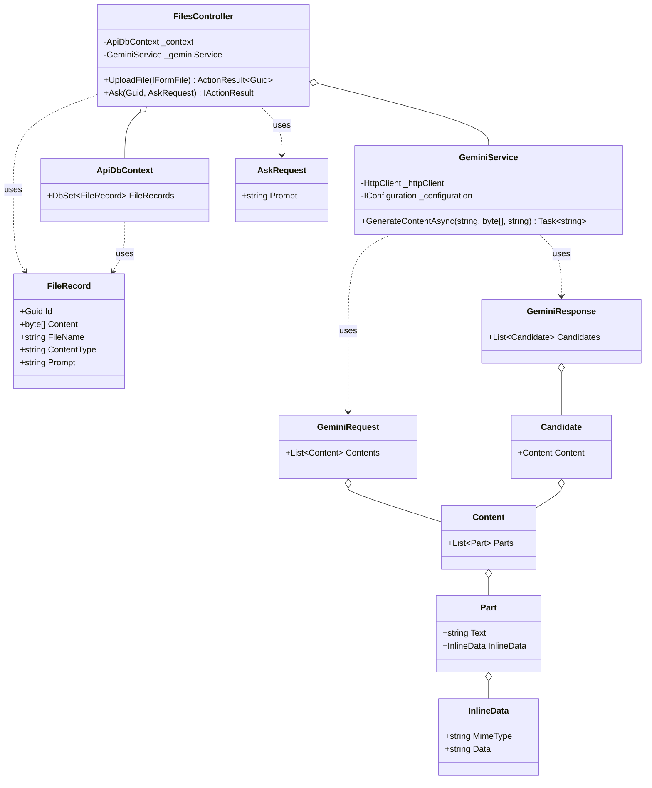

```mermaid
classDiagram
    class FilesController {
        -ApiDbContext _context
        -GeminiService _geminiService
        +UploadFile(IFormFile) ActionResult~Guid~
        +Ask(Guid, AskRequest) IActionResult
    }

    class GeminiService {
        -HttpClient _httpClient
        -IConfiguration _configuration
        +GenerateContentAsync(string, byte[], string) Task~string~
    }

    class ApiDbContext {
        +DbSet~FileRecord~ FileRecords
    }

    class FileRecord {
        +Guid Id
        +byte[] Content
        +string FileName
        +string ContentType
        +string Prompt
    }

    class AskRequest {
        +string Prompt
    }

    class GeminiRequest {
        +List~Content~ Contents
    }

    class Content {
        +List~Part~ Parts
    }

    class Part {
        +string Text
        +InlineData InlineData
    }

    class InlineData {
        +string MimeType
        +string Data
    }

    class GeminiResponse {
        +List~Candidate~ Candidates
    }

    class Candidate {
        +Content Content
    }

    FilesController o-- ApiDbContext
    FilesController o-- GeminiService
    FilesController ..> FileRecord : uses
    FilesController ..> AskRequest : uses

    GeminiService ..> GeminiRequest : uses
    GeminiService ..> GeminiResponse : uses

    ApiDbContext ..> FileRecord : uses

    GeminiRequest o-- Content
    Content o-- Part
    Part o-- InlineData

    GeminiResponse o-- Candidate
    Candidate o-- Content
```
