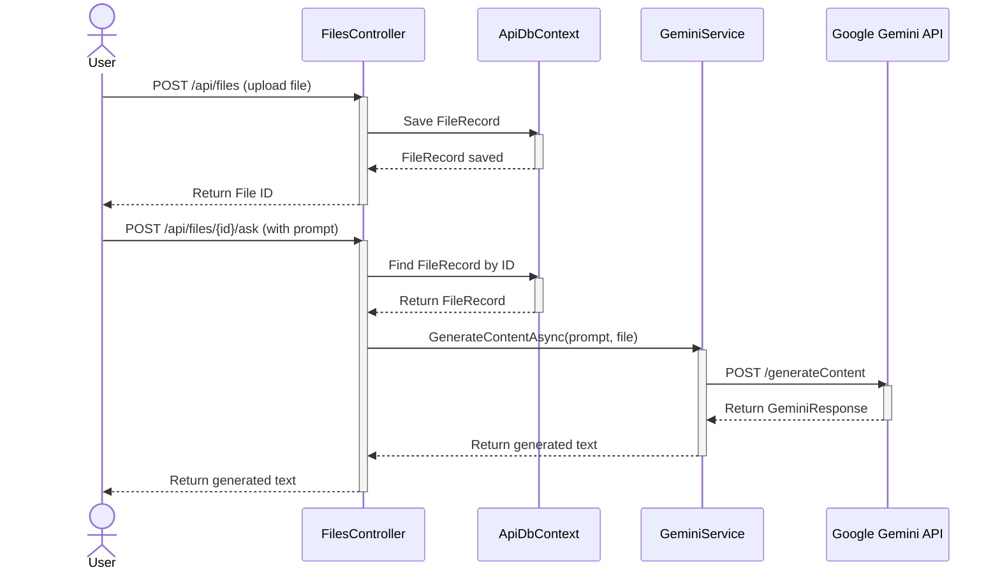

```mermaid
sequenceDiagram
    actor User
    participant FilesController
    participant ApiDbContext
    participant GeminiService
    participant Google Gemini API

    User->>FilesController: POST /api/files (upload file)
    activate FilesController
    FilesController->>ApiDbContext: Save FileRecord
    activate ApiDbContext
    ApiDbContext-->>FilesController: FileRecord saved
    deactivate ApiDbContext
    FilesController-->>User: Return File ID
    deactivate FilesController

    User->>FilesController: POST /api/files/{id}/ask (with prompt)
    activate FilesController
    FilesController->>ApiDbContext: Find FileRecord by ID
    activate ApiDbContext
    ApiDbContext-->>FilesController: Return FileRecord
    deactivate ApiDbContext
    FilesController->>GeminiService: GenerateContentAsync(prompt, file)
    activate GeminiService
    GeminiService->>Google Gemini API: POST /generateContent
    activate Google Gemini API
    Google Gemini API-->>GeminiService: Return GeminiResponse
    deactivate Google Gemini API
    GeminiService-->>FilesController: Return generated text
    deactivate GeminiService
    FilesController-->>User: Return generated text
    deactivate FilesController
```
